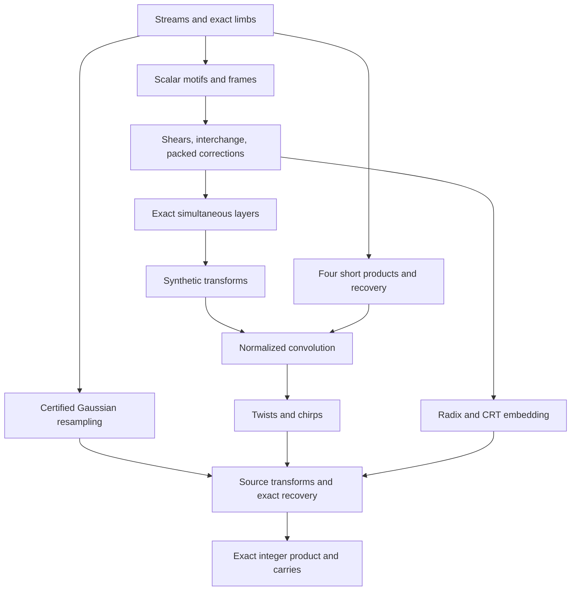

# STAR MUL-0: paper to executable arithmetic

Investigation date: 2026-10-08. This is an implementation plan with bounded models,
not an independent proof of the paper or a claim of a working full multiplier.
The archived intake and manuscript are unchanged.

## Immutable inputs and recovered work

| Input | Inspected revision |
|---|---|
| ComputerScience `how-long+how-wide` | `1aff11b8eefa6dd9da6d3a0a129111de90523e9c` |
| ICK `main` | `15f1f842f5da25f4e5a66fbbb18d24b99a141a8f` |
| Idriç ARM/Thumb `native-arm` | `0ccef59e21415585c265b79360164f7351baa1c5` |
| Backend's Idriç compiler pin | `081b9cde0591154839fb5d80d76e5570e0436300` |
| OpenAI manuscript | `adc7f1241b42e322a6451854ab7e4b4c146bf78a` |
| Archived PDF, verified by `git hash-object` | `dd2a4664f65aa22510ac1c568834573d3ebcc593` |
| Compared upstream head | `fd4aeeb2ee4fc729c18d98444fed42fd0529eeeb` |

`git diff` between the manuscript pin and inspected upstream head is empty for this
preprint directory. Its path history contains only the release commit. Other release
corrections/withdrawals do not amend this manuscript. Catalogue family 109 has no
corresponding Lean formalization found in the inspected catalogue. `lean/docs/130.md`
covers two other Fourier papers: subsequential circuits and a uniform exact-complex
arithmetic model. Its description expressly excludes bit-complexity claims from the
subsequential result. It is not verification of this multiplier.

Adjacent work must not be duplicated:

* dilapidated-shed/ick PR #80, “Recognize × multiplication in Icky C”, head
  `c5d28dde9cc333a562b907785d0370b725146cdf`: scalar glyph recognition, not this algorithm.
* dilapidated-shed/ick PR #81, “Preserve polar storage and binary128 math in native ICK”,
  head `143e29580c2644ea0f345fe609fa5673d036865d`: retained runtime work; do not invent
  a competing runtime-bootstrap fix. Its successful run 37804725251 supplies receipts,
  not an available ARM compiler binary. No ICK release binary was available here.
* dilapidated-shed/ick PR #79, “Execute the qualified ICK boundary on Android runtimes”,
  merged at the inspected main: reuse the exit-status and result-byte refusal contracts.
  Its Android runtime execution coverage does not qualify ARMv7 execution.
* `qualification/android-boundary/ick-armv7-neon-fft.c`, its semantic fixture, and
  `armv7-neon-fft.md` are existing vector-codegen baselines. Their relaxed Float32
  flags must not be imported into exact dyadic arithmetic.
* fuego-ironworks/idric-arm-thumb PR #95, “Run residue suite across all five narrow floats”,
  retained head `89406aef4a327707a7674834d8882bca1f24cd7e`. These closed requests
  preserve work, not acceptance.
* fuego-ironworks/idric-arm-thumb PR #101, “Lower canonical Idriç compact scalar types”,
  retained head `8d84ce768816c8db9886b99100814363cc89649d`, has a recorded parser failure.
* fuego-ironworks/idric-arm-thumb PR #102, “Add internal polar Complex64 to ARM Thumb”,
  retained head `c1afa30955d73a332d7ae136ad5c367811aa41e4`, has a recorded negative-harness
  failure. Polar Float32 pairs cannot represent the exact Gaussian dyadics here.
* Native `tests/branching/` and issue 82 already describe pending structured control flow;
  extend those fixtures when loops are actually needed. `notes/machine-convolution.md`
  is an exploratory convolution contract, not an implemented arbitrary-precision API.
* The concurrent STAR NIR-0 assignment already owns Mathematical → Numerical → Machine
  IR. This task consumes that separation and defines one algorithm contract; it does
  not establish a parallel general IR, source notation, or backend framework.

## Ownership and representation decisions

ComputerScience owns this decomposition, semantic corpus specification, alternatives,
provenance, parameter certificates, and selection evidence. ICK owns the first maintained
arithmetic code at the **new separable component** `arithmetic/openai2026/`. It is explicitly
experimental and is not automatically linked into programs or compiler runtime startup.
There is no maintained multiprecision/convolution library in the inspected ICK-owned
tree suitable for simply extending; imported GCC internals are not that library.

ICK compiler edits, only when independently necessary, remain complete replacement
files under `ick/source/`, materialized using `ick/materialize.sh`, with the existing
`ick/SOURCE.lock` GCC pin `6294f1d9e7536e5ffcde09d1528c918d63abfef5`. Never edit `gcc/`
as the ICK implementation. No optimizer recognition or automatic algorithm selection
is justified by this investigation.

Four milestones are separate: (1) code compiled by ICK, (2) a tested arithmetic component
distributed in the ICK repository, (3) compiler recognition/selection, (4) direct Idriç
native lowering. This plan authorizes jobs for 1, 2 and bounded parts of 4; 3 needs future
correctness and target-specific selection evidence.

The mathematical interface is exact nonnegative integer multiplication. API operands
have explicit bit lengths; unequal lengths are zero-extended to the common maximum,
including leading zeroes. Empty inputs represent zero. The output has capacity for the
sum of supplied lengths, or the explicitly requested padded 2n bits. Overflow of a machine
word is never the mathematical result.

The numerical contract uses signed arbitrary-size integer coefficients plus an explicit
nonnegative binary exponent. Gaussian dyadics are **rectangular exact pairs** of these
values. Arrays carry shape, axis order, physical slot mapping, coefficient width,
fractional width, and normalization exponent. No implicit rounding or implicit layout
conversion is allowed. Scalars and label fields are distinct: bit-network coefficients
are in F2 but its labels are rational; Gaussian-dyadic coefficients use binary labels.

The machine representation is 32-bit unsigned limbs, least-significant limb first,
explicit sign/magnitude for arithmetic, checked capacities, canonical zero, and checked
aliasing rules. Signed operations never invoke C signed-overflow behavior. Internal C
records are storage contracts, not mathematical syntax. Paper-model serialization is a
separate adapter: fixed-width two's-complement signed components, real before imaginary,
most-significant bit first, lexicographic arrays. Its conversion costs are recorded.
Truncation toward zero shifts magnitudes and restores signs; arithmetic right shift of
a negative value is not a substitute.

The Idriç native component implements the same serialized contracts directly. It does
not pass through C. Its current `IR.idr`, `Lower.idr`, `Emit.idr`, and `Codegen.idr` have
Word32 constants, Float32 buffer loads and Float32 arithmetic, but no integer arithmetic,
word stores, comparisons or general branch/loop representation. The result ABI remains
Float32-only despite Word32 arguments. Thus word result ABI and straight-line word
operations are the first native job; arbitrary-precision loops are a later prerequisite.

## Source-keyed dependency map

Source keys below refer to `build/sections/` at the immutable manuscript commit. LaTeX
labels avoid ambiguity where one source file contains two numbered sections. Each row
is a numerical operation, not an instruction-selection decision.

| Node / source | Mathematical I/O and representation | Restrictions, exactness, dependency, discriminating test |
|---|---|---|
| A. Streams — `02-streams.tex`, `lem:elementary-streams`, `lem:ordered-affine-streams` | Ordered bits/records; split, merge, row routing, late controlled rotations; Γ-coded descriptors | Fixed alphabet/tapes; controls precede target; charge counters/rewinds/descriptors. Test tagged payload order, spectators, empty pieces, inverse maps. Foundation for B–H. |
| B. Scalar networks — `03-motifs.tex`, `eq:motif-schedule`, `lem:scalar-motifs` | Eight copy/gather/scatter/side/undo steps implement y += x; three stages implement (x,y) → (−y,x), or bit swap | Ordered side pairs; arbitrary auxiliary inputs restored. Gaussian side coefficient −(|S∩T|−1)/2 for distinct overlap 0 or 2. Test nonzero signed/dyadic scratch and every basis source; delete undo/sign mutants. Reduced invocation modeled here. |
| C. Frames and finite labels — `eq:common-frame-identity`, `eq:motif-labels`, `lem:motif-residuals`, `prop:bit-motif-interface`, `prop:complex-motif-interface` | Assign common frame at each gate; edge D_out D_in^-1; endpoint signed routing on every role | Rational orthogonal projectors versus binary nondegenerate subspaces; nested labels. Scalar scratch restoration does NOT say framed scratch arrays remain unchanged. Generate residual bases, check inclusion/rank and route signs, compare full small operators including auxiliary roles. Depends B. |
| D. Address shear/interchange — `04-swap.tex`, `lem:lower-lower`, `lem:matrix-shear`, `prop:power-interchange`, `lem:chunk-swap` | (H,D) → (H+MD,D); triangular/permutation factorization; three shears exchange fields | Exact modulo q^e. Choose fixed prime avoiding all denominators and pivot numerators. Width e=m^k, row divisibility W^k for recursive kernel; radix padding/base-m decomposition remove restrictions. Test direct address bijection and payload order, never merely an array transpose timing. Depends A–C. |
| E. Packed address-bit changes — `05-layers.tex`, `lem:packed-selected-bit-rectangle`, `eq:eight-packed-additions` | Eight parity-controlled shifts toggle selected address bits and restore auxiliary address; packed analogue acts on spaced bits | K≥6 for packed lemma; guard interval [10,2^(K−1)−11]; bad addresses need T0 S0^-1 correction, key sort and reinsertion; highest bit handled separately. Exhaustive scalar parity test here; future boundary/guard tests must exercise exceptions. Depends A,D. |
| F. Exact simultaneous layer — `eq:phase-C`, `eq:phase-inverse-child`, `eq:phase-butterfly-layer`, `prop:simultaneous-layer` | C=((u+v+i(u−v))/2,(u+v−i(u−v))/2); H0=b S C S with b=(1−i)/2, S=diag(1,i); tensorized and framed | Exact Gaussian dyadics internally, endpoint phase i^(27f), inverse-child (−i)^f Z C^tensor Z and signed X routing. Reserve Δ=C0 d^20 fractional/headroom bits; round only completed contractive layer. Row reservation/padding required. Exact one-bit phase modeled here; tensor, direction and sign tests remain. Depends B–E. |
| G. Synthetic transforms — `06-transforms.tex`, `lem:synthetic-characters`, `eq:synthetic-dif`, `lem:synthetic-transform-cost` | Normalized transforms over C[y]/(y^r+1), y^(2r/t) roots; forward output L B F−; opposite F+ B^-1 L^-1 | r power two, t divides 2r, axis lengths r or r/2, valid K/precision/header bounds. Forward half-butterfly then negative monomial; opposite positive monomial before butterfly. Retain LB through products. Test direct DFT, impulses, mixed axis widths, signed wrap, normalization F+F−=I/M. Depends D–F. |
| H. Short polynomial products — `lem:signed-ring-product`, `eq:packing-separation` | Gaussian polynomials f=2^-p(a+ib), g=2^-p(c+ie) → Qp(fg/r) | r<2^p; base B0=2^(4p); four shorter signed integer products; centered extraction, negate wrapped high coefficients, divide by r and scale. Bound coefficients <2^(3p)<B0/2. Real reduced packing/fold model here; Gaussian4-product/sign-extension/precision tests required. Depends exact limb arithmetic and explicit short-multiplier provider. |
| I. Synthetic convolution — `prop:synthetic-convolution` | Two forward G calls, H pointwise, opposite G, scale M → f*g/(rM) | T=rM; error <sqrt(2) M(3ℓ+1)2^-p; exact scale widens output words. Compare direct negacyclic tensor convolution; omit M/r mutants. Depends G,H. |
| J. Gaussian resampling — `07-resampling.tex`, `lem:no-sort-resampling`, `lem:tensor-resampling` | Ordered line maps A=S/2 and B0=D′(N^-1/2)C retain permutations: R Fs=2^γ B0 Q Ft A | p>100, 2≤s<t<2^p, gcd(s,t)=1, 2≤α<sqrt(p), θ=t/s−1>p/α^4. Borrowed Gaussian routines and finite Neumann sum with ceil(p/(α²θ)) terms; each line-map error <p²2^-p. Certified roots/exponentials and tails mandatory. Test independently summed Gaussian maps and direct complex DFT with interval bounds. Depends exact arithmetic, not native backend. |
| K. Cyclic convolution/chirp — `08-assembly.tex`, twist subsection; `07`, `lem:chirp-permutation` | Twist last axis by ζ^k into negacyclic ring; I; untwist; then chirp QFt u=conj(a)·[a*(conj(a)·u)/T] | ζ^r=−1 cancels wrap sign; last axis contiguous, shape-only iota only when widths/order match. Exact dyadic phase products then Qp; do not store mathematical unit phases as Float32. Test wraps, permutations, conjugation and 1/T. Depends I and certified scalar routines from J. |
| L. Radix/CRT embedding — `08`, `eq:triangular-crt`, `eq:capacity` | Binary operands → radix-2^b coefficients → zero-padded box → tensor cyclic ring via Φ(x)=∏x_i^μ_i | Pairwise coprime s_i, μ_i=(∏j<i s_j)^-1 mod s_i; targets updated descending, inverse ascending; invalid padded addresses fixed. 2q−2<S prevents cyclic aliasing. Test unequal lengths, leading zeroes, explicit index maps and inverse; distinguish payload movement from Fourier pullback. Depends D, parameter preparation. |
| M. Source transforms and exact recovery — `08`, multiplication/precision subsections, `eq:source-error`, `eq:final-error` | Scale digits by 2^(-b−2); J→K→J with exact 2^γ scale twice; pointwise Qp; opposite source transform; two factors S; undo Φ; round real coefficients; carries | Both source transforms normalized: opposite of their product is convolution/S². Final total scale 2^(2b+4)S². Require certified final error <1/2 before nearest rounding; final carry scan and assert discarded high bits zero. Zero/ones/powers/long carries/boundary cases and missing S/carry mutants. Depends J–L. |

Dependency graph (the short-integer multiplier is an explicit leaf, not a hidden whole-input fallback):

## Where the saving is, and what obtaining the constants costs

At h=100 the construction has v=161700, N=v³=4227952113000000, m=h³=1000000.
Wire counts are Wb=177176569091445000000 and Wc=1873807244643542670000.
The dimension-loss ratios are Lb/N=100/539 and Lc/N=101/539. The corrected edge-rank
budgets (including N nonzero bit-source labels) are sb=177176569088785861287000000
and sc=1873807244636671267308000000. Each is strictly less than Wm. Splitting rows
among W role streams yields child volumes V/W; the summed child dimensions are s,
giving the normalized recurrence Fk ≤ (s/W) F(k−1)+O(1) rather than m F(k−1).
The framed butterfly analogue uses the corresponding phase-rank budget. These are
the mechanisms a full executor/counter would have to exhibit. Plain transpose, ordinary
FFT butterflies, or a reduced identity alone do not demonstrate them.

These are explicit finite construction recipes, but not a supplied small executable
table. Generate triples, ordered neighbor pairs, invocation coordinates, roles, labels,
residual bases, and matrices from the source formulae. Use rational elimination with
the manuscript pivot order; enumerate binary residual bases with deterministic tie
breaking and independently verify the nondegenerate restrictions. Emit role records
lazily, cache only within an explicit limit, and hash the resulting descriptor stream.
Generate denominators/pivots before selecting the first valid prime q by trial division.
Time, rational bit growth, peak storage, q-search and descriptor traffic must be charged.
An unmaterialized symbolic descriptor is not evidence that all roles were executed.
No finite search, q selection, or Gaussian constant table is free “precomputation”.

The fixed published choice is τ=σ=1−2^-50, λ=1−2^-52, c=2^-56, λ′=1−2^-54,
ε=2^-75, δ=1/16, β=1/2, κ=2^-182. With b=ceil(log2 n), p=6b, d=floor(b^ε),
d≥2 already requires b≥2^(2^75). The huge fixed W counts separately rule out
materializing the full role array here. Small h and altered dimension/precision choices
are useful **reduced algebra profiles**; they are not instances satisfying all published
inequalities. h=9 also makes the rational form singular and must be rejected.

Published parameter preparation selects a power-of-two T in [4n/b,8n/b), r and the
r/r/2 axes, α=ceil((12d²b)^(1/4)), and distinct primes s_i in the stated short intervals.
Even trial division to sqrt(candidate) has an explicit preparation cost; the paper
only absorbs it asymptotically. Implement a resource-limited, exact certificate builder
that rejects unsatisfied inequalities and unsupported sizes. Never allocate based on
an asymptotic `sufficiently large` assertion. Full cutoff p0/p1/n0 and a practical
complete h=100 schedule are not established by these experiments.

The paper's four packed polynomial products and scalar phase preparation use a previously
established O(N log N) multiplier on **shorter** arguments. Ordinary schoolbook/Karatsuba
or a library provider can be a clearly named reduced-model provider, with call sizes
and count logged. They do not inherit the paper's time theorem. No such maintained
theorem-compatible provider was found in the inspected projects. A call on the original
whole input, or delegating the final answer to the oracle, is not this construction.
Division/square-root corollaries later in this preprint are consequences, not prerequisites.

## Independent acceptance and costs

One versioned TSV corpus is owned here, with mathematical decimal/hex integers,
explicit widths, limb encodings, stage IDs, expected values, and provenance. Candidate
and oracle run as separate executables. A host Idriç Integer oracle uses the existing
runtime and direct definitions (quadratic convolution/direct permutation/direct DFT),
not the candidate schedule. Cross-check fixed oracle vectors by an independently
compiled elementary base-2 reference or known exact products. Neither oracle is linked
into the shipped component. The source dependency graph and artifact symbols must
exclude oracle linkage; a special bypass mutant must fail the provenance gate even
when its numerical outputs are correct.

Whole products: exhaustive 0..255 × 0..255; deterministic widths 0,1,7,8,15,16,31,32,
33,63,64,65,127,128,129,255,256,257,1023,1024,1025; unequal widths; zero, one, powers of
two, all ones, alternating bits, leading zeroes, and carry chains spanning every limb.
Seeded larger vectors record their generator and seed, not a system random state.
Internal cases include basis vectors, ordering/spectator tags, negative coefficients,
nonzero auxiliaries, wrap signs, ±precision-boundary residues, invalid descriptors,
exceptional packed addresses and normalization factors. Deliberate faults: dropped
carry, wrong wrap/phase, no undo, zero output, and oracle bypass. Require nonzero status
through the complete execution harness and mismatched bytes to be preserved.

Maintain three records, with no conversions between them implied:

1. Paper analysis: fixed alphabet/tapes, bit volumes, logical versus work space, all
   head moves/rewinds, setup, recursive call dimensions, precision, inequalities.
2. Instrumented execution: specify actual counters (gate/bit/limb operations, bytes,
   modeled tape-head motion, descriptor scans). A RAM vector access is not a tape step.
   Any omitted preparation/tape work is named. This investigation does not supply a
   complete tape simulator or recurrence validation.
3. Native measurements: exact device/ABI/compiler/flags/source+artifact hashes, sizes,
   wall time, memory, code bytes, conversion/allocation/preparation costs, repetitions.
   No candidate timing or crossover has been measured here. Conventional methods remain
   labeled baselines. Correctness under QEMU is not Android or physical performance.

## Implementation sequence and remaining gates

The first useful maintained slice is exact dyadic storage plus the eight-step scalar
network, including arbitrary scratch restoration and its direct oracle. This is small,
distinctive, and feeds framed layouts. It can start independently of ARM work. The word
ABI/arithmetic native job can also start immediately. Stream/frame generation and exact
numerical layers follow; certified Gaussian maps are separable from backend progress.
Only their tested composition may claim reduced whole-product execution. Published-profile
admission requires all local inequalities, full role schedule, guard-width validity,
and an identified appropriate short multiplier; it is presently blocked.

Keep Android armeabi-v7a, Thumb-2, softfp and eight-byte stack alignment explicit. Preserve
A32/DEX/other target paths. MIRO A1 physical execution is a separate acceptance gate;
C67 is not a substitute. Missing physical access blocks physical claims only.

Full independently pasteable jobs are in `sun-jobs.md` and must also be displayed in the
delivery response. No job is dispatched and nothing is merged by STAR MUL-0.
